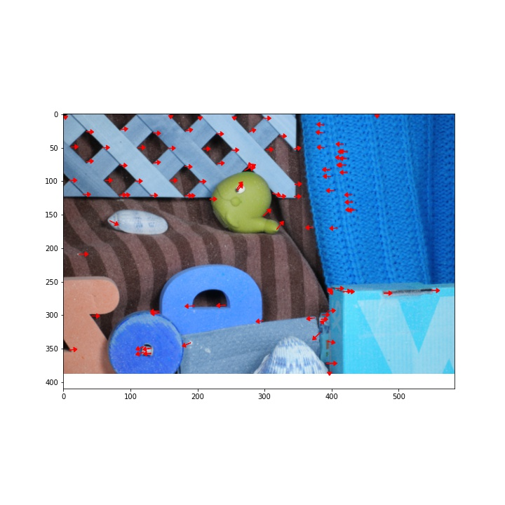

# Implementation of Optical Flow

This repository includes my implementation of the **Lucas Kanade's optical flow algorithm** which is the most general and challenging version 
of motion estimation. It involves computing an independent estimate of motion at each pixel.

**NOTE:** Please find details of experiments and implementation in `01 prelim report.pdf`.
## Algorithms and pipelines implemented: 
It includes:
* Keypoint Selection (Selecting Pixels to Track) via **implementations of Harris Corner detector and Shi-Tomasi Corner Detector**
* **Forward-Additive Sparse Optical Flow** using the approach defined by `Bruce D. Lucas` and `Takeo Kanade` in their 1981 IJCAI paper
* Contains experiments inolving changing different parameters of the algorithm like "window size", "smoothing operator used", "sigma used during gaussian smoothing" etc.
* **Multi-Scale Coarse-to-fine Optical Flow**: Here, the optical flow at a coarse image resolution is upsampled and refined at successively higher resolutions, up to the resolution of the original input images.

## Contents and some other details regarding directory structure:
* `harris_helper.py` and `lk_helper.py` contain all the interesting important functions used in the
assigmment
* `videos` of the 3 scenes with quiverplots is in the `./videos` directory.
* The 3 notebooks starting with the word “Harris” are the results of the Harris Corner Detector on
the 3 scenes. The main function used is :
    * <code>find_corners(img_array, kernel_x, kernel_y, do_gaussian=False, algo="harris",
sigma_val=1, k_val=0.04, window_size_for_aggregating=3,
window_size_for_suppression=11)</code>
    * THE PARAMETER MEANINGS HAVE been described in the latter part of the report.
    * Psi-Tomasi can be run by simply changing the parameter named “algo” to “shi-tomasi”
* The 3 notebooks starting with `Running Optical Flow` contain the results of the experiments on
using different params on the 3 scenes.
* `Comparing naive LK algorithm with Pyramidal implementation.ipynb` has my attempts to find
where can the “pyramidal implementation” produce better results
* `lk_method.ipynb`: contains just one running instance of the Lucas Kanade algorithm (DOES
NOT CONTAIN ANY EXPERIMENTS)
* `lk_pyramid.ipynb`: contains just one running instance of the PYRAMIDAL IMPLEMENTATION
of the Lucas Kanade algorithm (DOES NOT CONTAIN ANY EXPERIMENTS)
* The folder `./rough_notebooks` contains the notebooks I used to experiment with the official
OpenCV functions and to verify the correctness of my own algorithms by talling with the library
results

## Some outputs on images from the Middlesbury dataset

